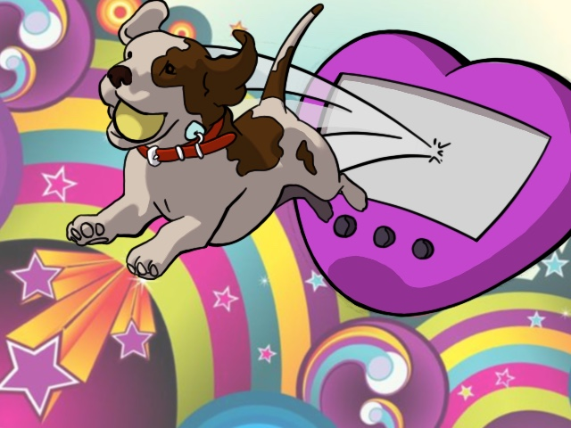

# Puppygotchi

An Interactive virtual pet a la Tamagotchi powered by Ruby on Rails and PostgreSQL.

## Getting Started

Puppygotchi runs on Rails 5.0.2 

### Prerequisites

To instaill dependencies:

`bundle install`

## Running the tests

Run the following command in the terminal:

`rails test`

## Deployment

Deloyed via Heroku [here](https://gentle-headland-58439.herokuapp.com)

## Built With

* [Rails](http://rubyonrails.org/) - The web framework used
* [PostgreSQL](https://www.postgresql.org/) - Database
* [bcrypt](https://rubygems.org/gems/bcrypt) - User authentication

## Authors

* **Mina Slater** - [Github](https://github.com/minaslater)

See also the list of [contributors](https://github.com/your/project/contributors) who participated in this project.

## License

This project is licensed under the MIT License - see the [LICENSE.md](LICENSE.md) file for details

## Acknowledgments

* Shoutout to Liz Abinante ([@feministy](https://twitter.com/feministy)) for the Puppygotchi name and idea
* Puppygotchi logo curtesy of DoodlingDev ([Github](https://github.com/doodlingdev))
